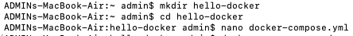
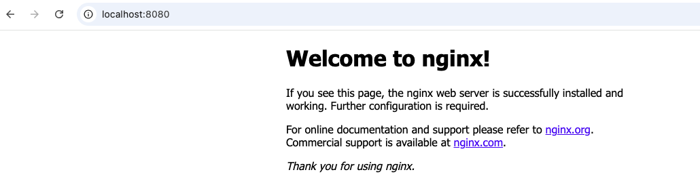

# 🐳 Docker Compose Setup on macOS (11 and newer)

This guide walks you through manually installing and running **Docker Compose v2.20.2** on macOS using the CLI — perfect for those using **Docker Engine v24.x** and looking for a lightweight, reliable setup without relying on Docker Desktop for Compose.

✅ Tested on **macOS 11 (Big Sur)** with **Docker 24.x**

📌 **Docker Compose v2.20.2** is compatible with **macOS 11 and newer** (Monterey, Ventura, Sonoma, etc.)

## Prerequisites:

- ✅ **macOS 11 (Big Sur)** or **newer** (Monterey, Ventura, Sonoma, etc.)
- ✅ **Docker Engine installed (v24.x recommended)**
- ✅ **Terminal** access with internet connectivity


## Steps: 
1. Check docker version

        docker version
   
   OR
   
        docker --version

  


2. Download Docker Compose v2.20.2 (recommended for Docker 24.x and macOS 11):

        mkdir -p ~/.docker/cli-plugins

        curl -SL https://github.com/docker/compose/releases/download/v2.20.2/docker-compose-darwin-x86_64 \
  	    -o ~/.docker/cli-plugins/docker-compose

        chmod +x ~/.docker/cli-plugins/docker-compose


3. Test it:

        docker compose version

 	**You should see something like:** Docker Compose version v2.20.2

  
<br>

---

# 🐋 Create and Run a Test Project

1. Create a Directory & docker-compose.yml

        mkdir hello-docker
        cd hello-docker
        nano docker-compose.yml


  

2. Paste the following into docker-compose.yml:

```yaml
version: "3.9"
services:
  web:
    image: nginx:alpine
    ports:
      - "8080:80"
```
            

  <br>
  Click ctrl O and then enter. Click ctrl x.
  <br>

3. Run the Container

        docker compose up -d

  

4. And then open this link to access the nginx container at:

        👉  http://localhost:8080
   
  

5. But if you encounter any error like this: 

        error pulling image configuration: download failed after attempts=6: ...
        lookup docker-images-prod...cloudflarestorage.com: no such host

  

* **Check Internet Connection**

    Make sure your Mac has a working internet connection and can resolve public domains.

    **Try in Terminal:**

        ping google.com
    
    If this fails — fix your network connection first.

    **What it should look like -**
  
   

* **Test DNS Resolution**

    Check if your system can resolve Docker's image host:

        nslookup docker.io
        nslookup cloudflare.com

    If your DNS is working correctly for docker.io and cloudflare.com, then this is not a general DNS issue. The error you're facing is more specific to how Docker is trying to resolve or reach a CDN-backed subdomain (used by Docker Hub to serve image layers).

    To resolve, try manually resolving the failing host. This is a deeper check. 
    
    **In terminal:**

         nslookup docker-images-prod.6aa30f8b08e16409b46e0173d6de2f56.r2.cloudflarestorage.com

    If it fails with “no such host” — then the DNS server you’re using (2409:...) does not resolve this dynamic Cloudflare R2 subdomain. 

    **It may look like this:**
  
  
    
    If DNS is failing, try switching to a public DNS like Google DNS or Cloudflare DNS:

    **To do this:**
    
        Open System Preferences > Network > Advanced > DNS

    **Add:**
	
        1.1.1.1
        8.8.8.8

    Click OK then Apply.
    
    Then in terminal try again 

        docker compose up -d

    **You should now see like this:**
    
  
<br>
    And then open this link to access the nginx container at:
 <br>       
        👉 http://localhost:8080
<br>
 <br> 
  
<br>
# Success!🎉
    
Your Docker Compose is now set up and working perfectly on macOS 11.

You can now use it to manage multi-container applications with ease. 

Happy Dockering! 🐳

# FYI:

Docker Compose binary is stored at  _~/.docker/cli-plugins/docker-compose_


